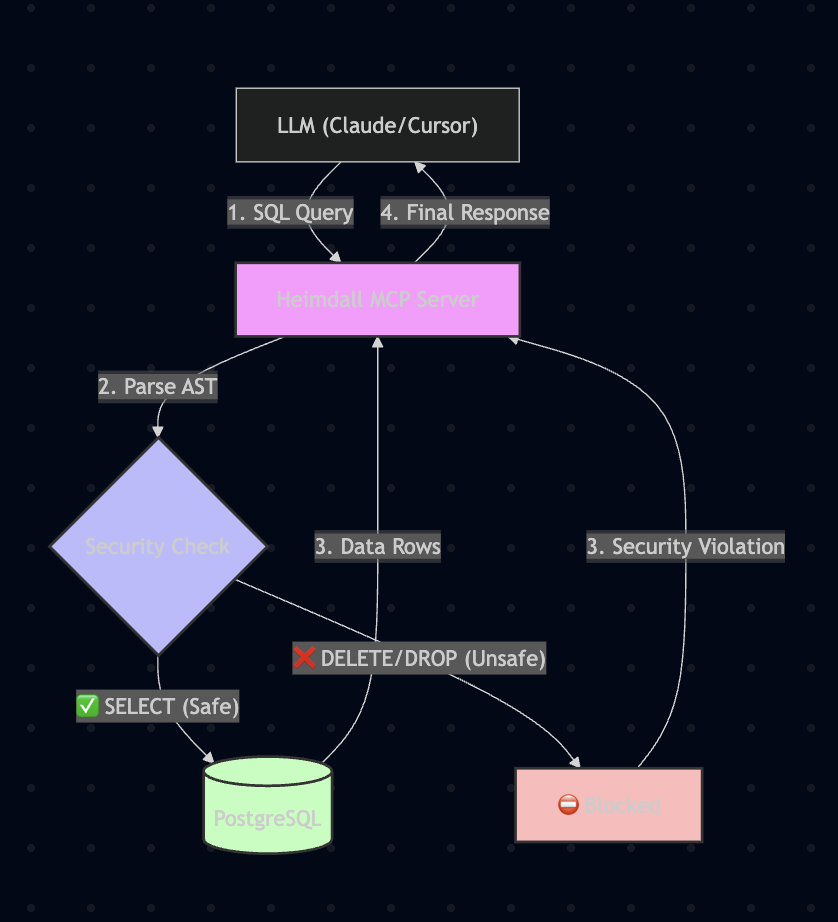

<!--  -->

## The Problem
LLMs often hallucinate destructive SQL commands (`DROP TABLE`, `DELETE`). Connecting them directly to production databases is a massive security risk, as they lack inherent context or safety boundaries.

## The Solution
I built a custom MCP Server in Golang that acts as a secure middleware "Gatekeeper".

- **Technology:** Golang, Model Context Protocol, PostgreSQL, AST Parsing (`xwb1989/sqlparser`).
- **Key Feature:** It utilizes a deterministic AST-based SQL parser to strictly block any non-SELECT statements before they ever touch the database connection pool.

### Key Metrics
- **0%** Data Loss incidents in testing i.e. 100% Block rate for destructive commands (DROP/DELETE).
- **<10ms** parsing latency overhead.
- **Protocol:** Implemented full Model Context Protocol (MCP) compliance.

### Links
- [GitHub Repository](https://github.com/AnubhavMadhav/Project-Heimdall)